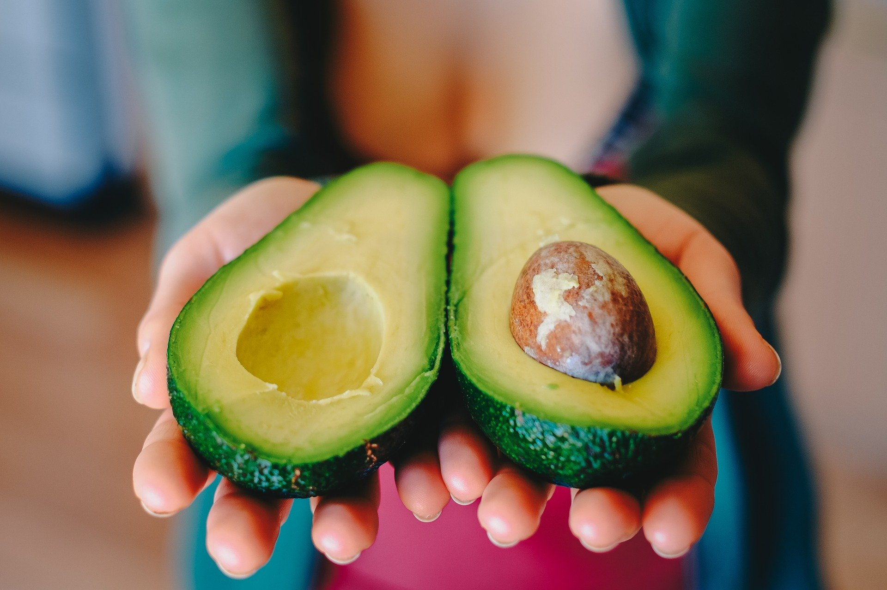

# Prediction of Average Prices of Avocado in USA

<h3>The Data has been taken from <a href="https://www.kaggle.com/neuromusic/avocado-prices" target="_blank">Kaggle</a></h3>
<h3>For Project Presentation <a href="https://youtu.be/x9XvqOo9sA0" target="_blank">Click Here</a></h3>

## Context
It is a well known fact that Millenials LOVE Avocado Toast. It's also a well known fact that all Millenials live in their parents basements.

Clearly, they aren't buying home because they are buying too much Avocado Toast!

But maybe there's hope… if a Millenial could find a city with cheap avocados, they could live out the Millenial American Dream.

## Content
The data represents weekly 2018 retail scan data for National retail volume (units) and price. Retail scan data comes directly from retailers’ cash registers based on actual retail sales of Hass avocados. Starting in 2013, the data reflects an expanded, multi-outlet retail data set. Multi-outlet reporting includes an aggregation of the following channels: grocery, mass, club, drug, dollar and military. The Average Price (of avocados) in the data reflects a per unit (per avocado) cost, even when multiple units (avocados) are sold in bags. The Product Lookup codes (PLU’s) in the table are only for Hass avocados. Other varieties of avocados (e.g. greenskins) are not included in this data.

## Columns in our dataset
- index
- Date: The date of the observation
- AveragePrice: The average price of a single avocado
- Total Volume: Total number of avocados sold
- 4046: Total number of avocados with PLU 4046 sold
- 4225: Total number of avocados with PLU 4225 sold
- 4770: Total number of avocados with PLU 4770 sold
- Total Bags
- Small Bags
- Large Bags
- XLarge Bags
- type: conventional or organic
- year: The year
- region: The city or region of the observation

## Models Used for Fitting
- ### Multiple Linear Regression
- ### Decision Tree Regression
- ### Random Forest Regression
